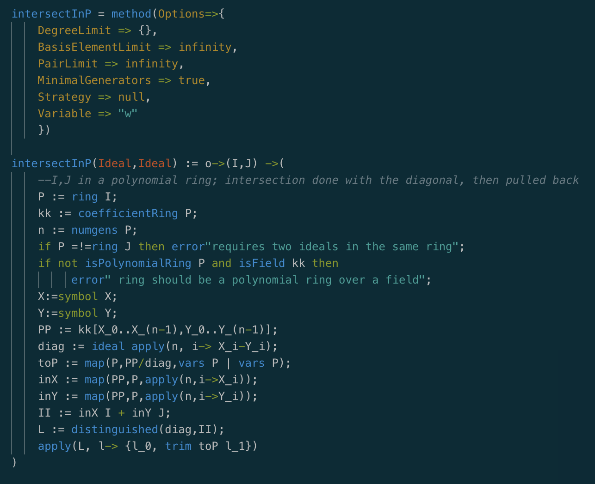

# Macaulay2 README

This extension provides support for the Macaulay2 language in Visual Studio Code.

## Features

### Now available
- A language grammar (and syntax highlighting)

### Coming soon
- Code completion with IntelliSense
- An integrated REPL

## Requirements

There are currently no requirements, but eventually you will be required to at least have a working installation of Macaulay2.
